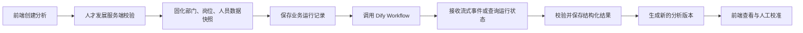

# 组织与关键岗位分析：工作流与 Dify 接口设计

## 1. 目标与边界

本期由人才发展服务端编排组织结构分析、关键岗位分析，并调用 Dify Workflow 完成 AI 计算。前端只提交业务配置、读取运行状态和结果，不直接调用 Dify，也不接触 Dify API Key。

Dify 官方文档同样要求 API Key 保存在服务端，避免密钥暴露在客户端。参考：

- [Dify API 快速开始](https://docs.dify.ai/en/api-reference/guides/get-started)
- [Dify Run Workflow](https://docs.dify.ai/en/api-reference/workflow-runs/run-workflow)

## 2. 总体工作流



关键原则：

- 一次分析只绑定一次不可变快照。
- 部门、岗位或人员在 UC 中删除、改名、调动，不回写历史分析。
- 重新分析创建新快照、新 `run_id` 和新版本，不覆盖旧结果。
- 快照同时保存来源 ID 与当时展示值，便于追溯。
- Dify 输出必须经过服务端 JSON Schema 校验后才能入库。

## 3. 数据快照

### 3.1 快照主表 `analysis_snapshot`

| 字段 | 说明 |
| --- | --- |
| `snapshot_id` | 快照 ID |
| `snapshot_type` | `org_analysis` / `key_position_analysis` |
| `source_system` | 数据来源，当前为 `UC` |
| `source_version` | 来源版本或同步批次 |
| `captured_at` | 快照生成时间 |
| `department_count` | 部门数 |
| `position_count` | 岗位数 |
| `employee_count` | 人员数 |
| `content_hash` | 快照内容哈希，用于完整性校验 |

明细分别保存部门、岗位、人员、任职关系。每条明细保留 `source_id`、`source_name`、层级路径、状态和分析所需字段。来源对象被删除后，历史明细仍保留，不再用实时表补名称。

### 3.2 版本关系

```text
analysis_run 1 ── 1 analysis_snapshot
analysis_run 1 ── 1 dify_workflow_run
analysis_run 1 ── 1 analysis_result_version
```

组织结构分析生成组织版本；关键岗位分析同时记录引用的组织版本和自己的岗位快照。这样能说明“当时基于哪个组织版本、哪些岗位数据、哪套配置”得到结果。

## 4. Dify 工作流编排

### 4.1 组织结构分析 Workflow

| 顺序 | Dify 节点 | 处理内容 | 关键输出 |
| --- | --- | --- | --- |
| 1 | Start | 接收 `run_id`、`snapshot_url`、配置和 Schema 版本 | 标准输入 |
| 2 | HTTP Request | 使用短时签名地址读取本次组织快照 | 部门、岗位、人员、任职关系 |
| 3 | Code | 校验数量、必填字段、ID 唯一性并做脱敏 | `normalized_snapshot` |
| 4 | Document Extractor | 解析岗位说明书和组织材料 | `material_text` |
| 5 | Iteration + LLM | 按岗位生成职责、能力和结构证据，不直接决定分组 | `position_evidence[]` |
| 6 | Code | 按已配置的岗位评价法、结构分析法计算确定性分数 | `position_scores[]` |
| 7 | LLM | 基于分数和证据提出序列、层级、岗位族建议及理由 | `structure_suggestion` |
| 8 | Code | 去重、校验岗位覆盖、补齐 Schema 并计算置信度 | `validated_result` |
| 9 | Output | 返回约定 JSON | 组织结构分析结果 |

职责/能力材料理解由 LLM 完成；权重、阈值、分数合成和岗位覆盖校验放在 Code 节点，避免同一输入因生成波动产生不同数学结果。

### 4.2 关键岗位分析 Workflow

| 顺序 | Dify 节点 | 处理内容 | 关键输出 |
| --- | --- | --- | --- |
| 1 | Start | 接收运行、快照、引用组织版本、视角和权重 | 标准输入 |
| 2 | HTTP Request | 读取岗位数据快照和组织版本摘要 | `position_snapshot` |
| 3 | Code | 校验岗位均属于快照，规范化缺口、供给、ART 等字段 | `normalized_positions` |
| 4 | Iteration + Code | 计算经济视角的需求/供给得分 | `economic_scores[]` |
| 5 | Iteration + Code | 计算能力视角 ART 与培养时间成本得分 | `ability_scores[]` |
| 6 | Code | 按用户配置权重合成关键系数并应用阈值 | `key_coefficients[]` |
| 7 | LLM | 为建议关键岗位生成简短、可追溯的业务理由 | `reasons[]` |
| 8 | Code | 校验岗位 ID、系数范围、建议标记与置信度 | `validated_result` |
| 9 | Output | 返回约定 JSON | 关键岗位分析结果 |

若只选择一个视角，合成节点将该视角归一为 100%；未选择的视角不执行。AI 建议不直接覆盖历史关键标记，业务服务按“历史分析命中或手工标记即保留”的累计规则计算最终标记。

## 5. 人才发展服务端 API

### 5.1 创建组织结构分析

`POST /api/talent/v1/org-analysis/runs`

```json
{
  "name": "2026 年组织结构分析",
  "department_ids": ["D001", "D002"],
  "material_file_ids": ["F001", "F002"],
  "methods": ["position_evaluation", "structure_analysis"],
  "dimension_config": {
    "task": 18,
    "authority": 17,
    "environment": 15,
    "professional": 20,
    "interpersonal": 15,
    "thinking": 15
  },
  "grid_config": { "sequence_count": 3, "level_count": 3 }
}
```

返回 `202 Accepted`：

```json
{
  "run_id": "OAR_20260731_001",
  "snapshot_id": "SNP_20260731_001",
  "status": "queued",
  "created_at": "2026-07-31T10:00:00+08:00"
}
```

### 5.2 创建关键岗位分析

`POST /api/talent/v1/key-position-analysis/runs`

```json
{
  "name": "2026 年度关键岗位分析",
  "org_version_id": "ORGV2",
  "scope": { "type": "position_family", "department_ids": ["D001", "D002"] },
  "views": ["economic", "ability"],
  "view_weights": { "economic": 50, "ability": 50 },
  "key_threshold": 0.75
}
```

### 5.3 查询运行状态

`GET /api/talent/v1/analysis-runs/{run_id}`

```json
{
  "run_id": "KPAR_20260731_001",
  "status": "running",
  "stage": "calculating",
  "progress": 68,
  "snapshot": {
    "snapshot_id": "SNP_20260731_002",
    "captured_at": "2026-07-31T10:00:00+08:00",
    "department_count": 4,
    "position_count": 34,
    "employee_count": 165
  }
}
```

状态统一为：`queued`、`snapshotting`、`running`、`validating`、`succeeded`、`failed`、`cancelled`。

### 5.4 结果与取消

- `GET /api/talent/v1/org-analysis/runs/{run_id}/result`
- `GET /api/talent/v1/key-position-analysis/runs/{run_id}/result`
- `POST /api/talent/v1/analysis-runs/{run_id}/cancel`

创建接口要求请求头 `Idempotency-Key`。同一租户、同一幂等键重复提交时返回原 `run_id`，避免用户多次点击产生重复分析。

## 6. Dify Workflow 对接

### 6.1 服务端调用

人才发展服务端调用：

`POST {DIFY_BASE_URL}/v1/workflows/run`

```json
{
  "inputs": {
    "run_id": "KPAR_20260731_001",
    "snapshot_url": "https://internal-object-store/signed/snapshot.json",
    "config": "{...}",
    "output_schema_version": "1.0"
  },
  "response_mode": "streaming",
  "user": "tenant:T001:operator:U001"
}
```

请求头：

```http
Authorization: Bearer ${DIFY_API_KEY}
Content-Type: application/json
```

`DIFY_API_KEY` 仅存在服务端密钥管理系统。`snapshot_url` 使用短时签名地址，且只允许访问当前运行绑定的快照。

### 6.2 状态跟踪

优先消费 Dify SSE 事件并保存 `workflow_run_id`、节点状态和错误信息；连接中断后，服务端使用 Dify 运行详情接口恢复状态：

`GET {DIFY_BASE_URL}/v1/workflows/run/{workflow_run_id}`

Dify 状态映射：

| Dify 状态 | 业务状态 |
| --- | --- |
| `running` / `paused` | `running` |
| `succeeded` / `partial-succeeded` | `validating`，通过校验后为 `succeeded` |
| `failed` | `failed` |
| `stopped` | `cancelled` |

### 6.3 输出约定

组织结构分析输出：

```json
{
  "schema_version": "1.0",
  "sequences": [{ "code": "RD", "name": "研发", "reason": "..." }],
  "levels": [{ "code": "L3", "name": "高级", "reason": "..." }],
  "position_groups": [{
    "group_code": "G-RD-3",
    "sequence_code": "RD",
    "level_code": "L3",
    "position_source_ids": ["P001", "P002"],
    "score": 0.86,
    "evidence": ["..."],
    "confidence": 0.91
  }]
}
```

关键岗位分析输出：

```json
{
  "schema_version": "1.0",
  "positions": [{
    "position_source_id": "P001",
    "economic_score": 0.91,
    "ability_score": 0.86,
    "key_coefficient": 0.89,
    "is_key_suggested": true,
    "reasons": ["需求高、内部供给少", "培养周期长"],
    "evidence": ["..."],
    "confidence": 0.9
  }]
}
```

输出中的岗位只能引用当前 `snapshot_id` 内的 `source_id`。出现未知岗位、重复岗位、分数越界、缺少必填字段或 Schema 版本不兼容时，本次运行进入 `failed`，不得产生业务版本。

## 7. 重试、审计与人工校准

- 网络失败或 Dify 5xx：指数退避重试 3 次；仍失败则标记失败，可基于同一快照重新运行。
- 业务输出校验失败：不自动重试，记录原始输出与校验错误，便于修复工作流。
- 每次人工校准记录调整前值、调整后值、操作人、时间和原因。
- 生效版本不可直接覆盖；重新分析或重新校准产生新修订记录。
- 日志不记录 API Key、签名快照地址和人员敏感字段。

## 8. 本期验收标准

- 部门或岗位在 UC 删除、改名后，历史分析名称、范围和结果不变化。
- 同一配置重复提交不会产生两次运行。
- Dify 运行失败时前端能看到业务化失败状态并可重试，不能看到密钥或内部堆栈。
- Dify 返回非约定岗位或非法分数时，不生成分析版本。
- 结果页能展示组织版本、快照时间、范围数量和运行版本，具备可追溯性。
