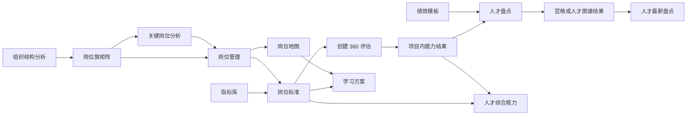

# 人才发展 · 当前版本 PRD

| 项目 | 内容 |
| --- | --- |
| 文档版本 | V1.4 |
| 原型基线 | `app/` 当前可运行版本 |
| 基线日期 | 2026-08-26 |
| 文档状态 | 当前原型冻结基线 |
| 适用端 | 管理端 Web；学员端仅定义功能开关 |

> 本文是当前版本的统一产品需求基线。用户在对话中最新、明确的结论如与已有 PRD、原型或历史资料冲突，以最新对话结论为准，并须在同一轮修改中同步回本文与根目录 `PROJECT_HANDOFF.md`。同步后以本文作为完整需求基线；历史 PRD 仅作为设计过程资料。组织结构分析和关键岗位分析的服务端工作流及 Dify 对接细节，继续以 `10_组织与关键岗位分析_Dify工作流接口.md` 为准。
>
> PRD 中的业务规则、数据规则和验收说明不等同于页面文案。快照、数据基准、存储、回写、接口和算法等内部实现信息不得直接展示给业务用户。

---

## 1. 产品概述

### 1.1 产品定位

人才发展用于建立岗位和人才之间可复用的数据链：先明确组织结构与关键岗位，再配置岗位标准，通过 360 评估和人才盘点形成能力与人才结果，最终在岗位地图和人才档案中使用这些结果。

当前版本聚焦管理端核心流程，不建设独立首页，不设置独立 AI 对话入口，也不在导航中展示延期功能。

### 1.2 当前需要解决的问题

1. 部门、岗位、人员、岗位标准和人才结果分散，缺少统一关系。
2. 关键岗位识别依赖人工判断，过程缺少结构化依据与人工校准机制。
3. 360 评估的能力指标选择、过程监控和报告查看需要形成连续流程。
4. 人才盘点缺少统一的数据口径，现有宫格只能回答人员落位，难以支持多维人才识别和组织规律洞察。
5. 岗位发展通道、学习方案与人才实际能力没有共享同一岗位基础。

### 1.3 本期目标

- 跑通组织结构分析和关键岗位分析两条工作流。
- 以具体岗位为业务承载对象，配置岗位标准和学习方案。
- 复用能力指标，完成 360 评估创建、过程监控和报告查看。
- 支持宫格盘点和人才图谱盘点：宫格盘点形成人员落位与校准结果，人才图谱盘点形成组织规律分析与人才分层。
- 在人才列表和人才详情中呈现岗位要求、实际能力和最新盘点结果。
- 用岗位地图串联岗位、职级、发展通道和学习方案。

### 1.4 成功标准

- 当前导航中的所有业务入口均可进入对应页面，不出现延期功能入口。
- 组织分析、关键岗位分析、360 评估、人才盘点四条主流程均具备入口、配置、结果或详情页面。
- 岗位标准、360 结果、盘点结果和人才详情使用一致的能力指标口径。
- 所有列表页均支持范围选择或筛选、主操作、列表和固定分页区域。
- 页面不暴露快照、接口、数据库、回写策略或内部算法实现说明。

---

## 2. 用户与角色

| 角色 | 当前版本职责 | 主要功能 |
| --- | --- | --- |
| 人才发展管理员 / HR | 组织与岗位分析、标准配置、评估与盘点、人才查看 | 除系统级设置外的全部管理端功能 |
| 系统管理员 | 维护职级和学员端功能开关 | 系统设置 |
| 业务负责人 | 作为项目负责人参与评估、盘点和校准 | 项目查看、催办、校准；具体权限待后端确定 |
| 学员 / 被评人员 | 参与评估并查看已开放的学员端功能 | 本期仅配置“人才画像、岗位发展通道”是否显示；学员端页面不在本原型范围 |

权限矩阵、数据范围和字段级权限尚未在当前原型中表达，后端设计时须单独确认。

---

## 3. 本期范围

### 3.1 一级导航与业务入口

| 一级中心 | 顶部业务菜单 | 入口页面 |
| --- | --- | --- |
| 岗位中心 | 组织结构 | `org-structure.html` |
| 岗位中心 | 关键岗位分析 | `key-position.html` |
| 岗位中心 | 岗位管理 | `positions.html` |
| 岗位中心 | 指标库 | `vocabulary.html` |
| 评鉴中心 | 评鉴工具 / 360评估 | `assess-projects.html` |
| 评鉴中心 | 评鉴工具 / 人才测评 | `talent-assessment-projects.html` |
| 评鉴中心 | 评鉴工具 / 考试 | `exam-projects.html` |
| 评鉴中心 | 人才盘点 | `review-projects.html` |
| 发展中心 | 岗位地图 | `position-map.html` |
| 人才中心 | 人才列表 | `talent-list.html` |
| 系统设置 | 职级管理 | `settings.html#level` |
| 系统设置 | 功能设置 | `settings.html#learner` |

`index.html` 不承载首页内容，进入系统后直接跳转到岗位管理。

### 3.2 延期或不在当前导航中的功能

| 功能 | 当前处理 |
| --- | --- |
| 模型库 / 岗位族独立模型 | 延期；岗位标准直接配置到具体岗位 |
| 考试题库、考试项目创建、详情、人才发展考试组卷 | 延期；当前仅开放考试列表与类别管理 |
| 测评结果独立页面 | 取消独立入口；结果跟随 360 项目查看 |
| 人才测评项目创建与详情 | 延期；当前仅开放人才测评列表与类别管理，动力、潜力专家问卷仍由专家维护 |
| 历次盘点对比 | 延期 |
| 职级地图 | 延期；当前仅维护岗位地图使用的职级 |
| 个人发展计划 IDP | 延期 |
| 独立人才池、继任地图、组织看板 | 独立导航和跨项目人才池延期；当前仅在人才盘点项目内组建人才池 |
| 独立首页、独立 AI 对话 | 不建设 |

旧页面直接访问时统一回到当前范围内的对应入口：

- `assess-results.html` → 评鉴工具 / 360评估
- `assess-tools.html` → 评鉴工具 / 360评估
- `review-compare.html` → 人才盘点
- `level-map.html`、`idp-list.html` → 岗位地图
- `talent-pool.html`、`succession-map.html`、`org-dashboard.html` → 人才列表

---

## 4. 信息架构与全局流程

### 4.1 导航结构

- 左侧固定为一级中心：岗位中心、评鉴中心、发展中心、人才中心、系统设置。
- 顶部显示当前一级中心下的业务菜单。
- 详情页、向导页和结果页继承所属中心的导航，不新增孤立入口。

### 4.2 核心业务流程



### 4.3 核心业务对象关系

```text
组织版本
  └─ 岗位族（序列 × 层级，仅展示、归类和分析聚合）
       └─ 岗位（当前业务承载对象）
            ├─ 关键岗位标记
            ├─ 岗位标准
            │    ├─ 任职：职责、任务
            │    └─ 资格：经历、能力、动力、潜力
            ├─ 学习方案：课程、项目、前测、后测
            └─ 岗位地图节点

员工 ──岗位──> 岗位要求
员工 ──360/既有考试结果──> 实际能力
员工 ──人员数据 + 绩效数据 + 测评数据──> 宫格或人才图谱结果
```

---

## 5. 全局业务规则

### BR-01 业务颗粒度

- 岗位族由“序列 × 层级”组成，仅用于组织结构展示、岗位归类和关键岗位分析聚合。
- 岗位标准、360 评估关联和学习方案均配置到具体岗位。

### BR-02 关键岗位标记

- 关键岗位分析结果需要落到具体岗位。
- 岗位也可在岗位管理中手动标记为关键。
- 某岗位被历史分析命中或被人工标记后，可持续作为关键岗位使用。
- 取消关键标记不得删除岗位已配置的标准和学习方案。

### BR-03 指标使用

- 能力指标可由企业创建、编辑、分类和分级，并可被岗位标准、360 问卷和人才能力结果复用。
- 动力、潜力使用固定指标库，不提供企业新增入口。
- 动力、潜力与专家人才测评相关，不用于当前 360 项目。

### BR-04 能力结果

- 360 评估结果按能力指标输出分数和等级。
- 同一人员、同一能力存在多个有效考试或评估结果时，人才综合能力取最高等级。
- 人才详情中的岗位要求来自当前岗位标准，实际能力来自最新有效结果。

### BR-05 人才盘点

- 人才盘点包含“宫格盘点”和“人才图谱盘点”两种方法，使用人才盘点页内二级页签分开管理项目。
- 盘点只能选择已结束的测评项目；盘点流程中不新建测评。
- 盘点活动由“项目数据”和“绩效数据”组成：项目数据提供能力结果，绩效数据由模板上传并固定为低、中、高三级。
- 同一能力存在多个被选项目结果时取最高分。
- 所选人员某项能力没有结果时，该能力按 0 分计入盘点。
- 绩效模板字段为工号、姓名、部门、岗位、绩效等级；绩效等级仅允许低、中、高。
- 宫格盘点当前使用能力与绩效两个维度，允许互换横轴和纵轴，不允许选择其他维度。
- 能力总分默认按百分制分档：`0%–60%` 为低、`60%–80%` 为中、`80%–100%` 为高；当前版本不开放区间修改。
- 宫格展示文案可在盘点规则中逐格修改；项目创建后使用本次规则生成落位。
- 人才图谱盘点在页面中按人员、绩效、能力、动力、潜力五类业务数据配置，不增加人员或花名册导入入口；业务页面不展示 APP、People、Performance、Assessment 等方法论内部术语。
- 人员数据来自人才列表和组织岗位数据；绩效数据沿用固定上传模板且当前仅有低、中、高绩效等级；能力、动力、潜力数据均来自已结束且存在有效结果的测评项目，具体字段必须取自当前指标库词典。
- 人才图谱以两个盘点维度为一组形成规律分析，覆盖人员结构、绩效分布、评鉴指标关系、人员与绩效、绩效与评鉴指标、人员与评鉴指标六类维度组合。
- 人才图谱以统计图表呈现分布、差异和相关关系，不提供宫格视图，不以纯文本卡片替代规律图表。
- 人才图谱之后展示人才分层；人员属性只用于分组比较，不参与优劣评分。对绩效等级及有效的能力、动力、潜力评分字段统一标准化，先分别汇总四类评分，再形成综合分并按百分位划分 A/B/C/D。
- 人才图谱项目不提供盘点校准、人才池、结果导出和手工结束入口；人才详情仍可从分层名单进入。
- 宫格盘点创建后锁定盘点人员、项目数据、绩效数据和盘点规则；人才图谱盘点创建后锁定盘点人员、五类盘点数据和盘点维度。
- 校准以任务方式管理；校准只修改人员落位，不修改能力与绩效原始数据，并记录校准任务、操作人和调整前后落位。
- 人才池属于当前盘点项目的结果应用，可从本次盘点人员中按盘点维度和维度分层组建，不作为独立导航菜单。

### BR-06 数据变更与历史结果

- 组织结构分析和关键岗位分析运行时，服务端须固化本次使用的部门、岗位、人员及展示名称。
- 后续基础组织数据发生删除、改名或调动时，不得改变已经生成的历史分析结果。
- 该规则属于后台数据处理要求，不在业务页面展示实现说明。

### BR-07 AI 使用原则

- AI 入口嵌入具体业务任务，不提供独立 AI 对话。
- AI 负责读取材料、匹配、生成建议或解释；权重合成、阈值判断和数据校验由确定性规则完成。
- AI 输出均为建议，须允许用户查看依据、调整或确认后生效。

### BR-08 数据与筛选一致性（2026-08-26）

- 列表筛选条件只能引用该列表数据中真实存在的维度；选项值必须与列表值域一致，不得出现选中后永远无结果的"幽灵选项"。
- 示例数据必须取自本项目统一口径：岗位取岗位管理在册岗位，部门取组织范围（研发中心 / 销售中心 / 职能中台），不引入外部系统样例（如"时光易培"来源、"电商运营"岗位、"所在组"合成字段）。
- 全站类别树面板（360 评估、人才测评、考试、人才盘点、关键岗位分析、指标库）统一规格：管理类别齿轮 32×32、类别标题 13px/600。
- 静态资源引用带版本参数（`styles.css?v=` / `app.js?v=`），每次部署更新版本号，避免浏览器缓存旧版造成页面间"假性不一致"。

---

## 6. 岗位中心需求

### 6.1 组织结构

#### 页面与流程

| 页面 | 用途 |
| --- | --- |
| `org-structure.html` | 查看当前组织结构矩阵、岗位族统计、历史分析 |
| `org-analyze.html` | 配置一次新的组织结构分析 |
| `org-analyzing.html` | 查看 AI 分析进度 |
| `org-preview.html` | 预览、校准并确认新的组织结构版本 |

#### 功能要求

| ID | 要求 | 优先级 |
| --- | --- | --- |
| ORG-01 | 默认进入组织结构后直接展示已有矩阵；只有确实没有结果时才展示空状态 | P0 |
| ORG-02 | 矩阵横轴为序列、纵轴为层级，层级自下而上递增 | P0 |
| ORG-03 | 单元格展示岗位族名称、岗位数、人数和组编码 | P0 |
| ORG-04 | 支持综合视图、岗位评价法视图、结构分析法视图切换 | P1 |
| ORG-05 | 点击岗位族可查看组内岗位、AI 序列、AI 层级、岗位评价分和依据 | P0 |
| ORG-06 | 支持查看历史分析、查看方法说明和新建分析；操作按钮位于矩阵列表左上角（与全站列表主操作位置规范一致） | P0 |
| ORG-07 | 新建分析生成新版本草稿，不直接覆盖当前生效版本 | P0 |

#### 分析向导

> 2026-08-26 简化操作流程：向导保留**三步步骤条**（组织范围 → 说明材料 → 生成）；分析方法、维度配置、宫格设置暂不开放用户配置，相关参数由 Dify 工作流以内置默认参数执行。被移除步骤的代码不在页面保留，完整向导结构见 git 历史。

1. **组织范围**：在部门树中勾选范围，右侧同步展示岗位、类别和人数。
2. **说明材料**：上传岗位说明书、组织架构图等材料，展示解析状态，支持删除和重试。
3. **生成**：展示业务配置汇总（仅组织范围、说明材料、生成物；内置默认口径不在页面展示），确认后开始分析。

被移除的原步骤（Dify 内置默认口径）：

- 分析方法：默认岗位评价法 + 结构分析法（原可选结构设计法、岗位定义法、人效分析法）。
- 维度配置：默认按所选方法内置指标与权重。
- 宫格设置：默认 AI 自动归类。

#### 结果预览与生效

- 分析过程显示读取组织数据、按方法打分、推断序列/层级、归类岗位族等业务阶段。
- 用户可稍后查看，也可进入结果预览。
- 预览页显示草稿矩阵、待人工归类岗位和多方法结论不一致项。
- 用户可查看归类依据、选择最终归属或保留当前归类。
- 支持保存草稿和确认生效；确认生效后成为新的当前组织结构版本。

#### 验收要点

- 首次有数据进入页面时不出现空状态。
- 调整后的岗位在矩阵中有明确标记，并可追溯调整依据。
- 未人工确认前，新结果不替换当前版本。

### 6.2 关键岗位分析

#### 页面与流程

| 页面 | 用途 |
| --- | --- |
| `key-position.html` | 分析项目列表 |
| `key-position-new.html` | 新建或编辑分析 |
| `key-position-analyzing.html` | 查看 AI 分析进度 |
| `key-position-result.html` | 查看分析结果和人工校准 |

#### 项目列表

- 左侧为分析项目类别，显示“全部”和各类别及项目数量；支持新增类别、修改类别名称和删除空类别，已有项目的类别不可直接删除。
- 支持按项目名、状态筛选。
- 列表字段：项目名、类别、引用组织结构、分析范围、所用视角、关键岗位数、状态、负责人、操作。
- 项目状态：草稿、分析中、已完成；操作随状态提供编辑、提交、查看结果、终止、删除。

#### 新建分析页

> 2026-08-26 简化操作流程：新建分析为**单页表单**，无步骤条、无生成确认汇总；原向导的选范围、选视角、视角配置、生成确认步骤暂不开放用户配置，相关参数由 Dify 工作流以内置默认参数执行。原向导代码不在页面保留，完整结构见 git 历史。

- 新建页分两节：**基本信息**（项目名、类别、分析目标）与**引用组织结构版本**（独立分节标题）。
- 引用版本为下拉选择，可选组织结构分析的全部版本（当前 V2 生效中、V1 已存档），不再限定生效中版本；分节头部右侧显示选中版本名与状态标签。选中后节内联动展示该版本的岗位族矩阵（宫格随版本规格，V2 为 3×3、V1 为 3×2）与序列 / 层级 / 岗位族 / 覆盖人数统计，矩阵元素与组织结构页对应版本的数据一致。
- 底部固定操作区：取消、开始分析。
- 点击开始分析先进入过渡页 `key-position-analyzing.html`（分析耗时较长，样式与组织结构分析的过渡卡一致）；卡片元素必须与表单和引用版本数据一致：项目名、引用组织结构版本摘要、双视角口径，进度阶段为读取组织版本数据 → 经济视角打分 E → 能力视角打分 C → 合成关键系数与理由。过渡页提供稍后查看（回列表）和查看分析结果。
- 分析范围（岗位族颗粒度并映射到具体岗位）、视角（经济 E + 能力 A）、权重与阈值（0.75）均为 Dify 内置默认，不在页面展示。

#### 结果页

- 分别展示经济视角、能力视角和综合视角。
- 经济视角使用需求 × 供给象限；能力视角使用 ART × 培养时间成本。
- 列表展示岗位、关键系数、经济象限、关键建议和操作。
- 支持查看依据、对多视角差异岗位进行人工校准；结果页不提供导出按钮。
- 对建议关键岗位确认后，更新岗位的关键标记；用户可继续进入岗位管理配置岗位标准或学习方案。

#### 验收要点

- 仅选择一个视角时，该视角按 100% 计算。
- 权重合计不为 100% 时不可提交或必须明确提示。
- 系数达到阈值的岗位展示建议关键，未达到阈值的岗位不得自动标记。
- AI 建议不能跳过人工确认直接生效。

### 6.3 岗位管理

#### 列表

- 提供“关键岗位”和“全部岗位”两个视图，默认显示关键岗位。
- 左侧按岗位类别选择范围；右侧按岗位名/编号、岗位类别筛选。
- 岗位数据不包含"所在组"字段；岗位归类由类别与层级表达，筛选条件不得引用数据中不存在的维度。
- 全部岗位视图主操作为“新增岗位”；关键岗位视图主操作为“添加关键岗位”。
- 列表字段：编号、岗位名称、类别、关键岗位、操作。
- 行操作：编辑、岗位标准、学习方案。

#### 岗位详情

岗位详情包含三个页内模块：

1. **岗位信息**：岗位编号、岗位名称、岗位类别、关键岗位状态。
2. **岗位标准**：任职、资格。
3. **学习方案**：关联课程、项目、前测和后测。

岗位标准要求：

- 任职由职责和任务构成，支持 AI 创建或人工新增、删除。
- 资格包含经历、能力、动力、潜力。
- 能力按雷达图分组；单岗位最多 50 组，每组最多 20 项，同一岗位内能力项不可重复。
- 能力项选择时配置岗位要求等级。
- 动力、潜力只能从固定库选择。

学习方案要求：

- 支持 AI 配课。
- 支持关联培训平台课程、培训项目和已有考试作为前测、后测。
- 支持移除已关联内容。

### 6.4 指标库

指标库包含能力、动力、潜力三个页签。

| 类型 | 企业权限 | 是否分级 | 主要用途 |
| --- | --- | --- | --- |
| 能力 | 可新增、编辑、删除、分类 | 可选行为等级 | 岗位标准、360 评估、人才能力 |
| 动力 | 只读固定库 | 不分级 | 专家人才测评 |
| 潜力 | 只读固定库 | 不分级 | 专家人才测评 |

能力列表支持类别树、名称查询、类别管理、新建能力和分页。能力字段包括名称、类别、描述、是否分级、等级及行为表现。

---

## 7. 评鉴中心需求

### 7.1 评鉴工具与 360 评估

- “评鉴工具”与“人才盘点”是评鉴中心的两个顶部一级业务入口，不将 360评估与人才盘点并列。
- 评鉴工具下使用“360评估 / 人才测评 / 考试”二级页签；三个页签均使用相同的列表、类别树、类别管理和分页规范。
- 三类项目的类别仅用于项目管理与列表筛选；支持新增、改名和删除，类别下已有项目时不得直接删除。

#### 项目列表

- 使用左侧类别树和右侧项目列表，类别树提供管理入口。
- 支持按项目编号 / 名称查询；列表提供新建、添加授权、移除授权、导出已选项、导出当前结果。
- 列表字段：项目编号、项目名称、创建人、完成率、状态、操作。
- 草稿项目操作：发布、项目设置、宣传设置、复制、删除。
- 已开启项目操作：关闭、项目设置、宣传设置、复制、统计。
- 列表支持横向滚动，操作列固定在最右侧，分页器位置固定。
- 新建使用独立全屏编辑页 `assess-new.html`；当前页面只展示项目标题、左侧能力指标选择、预览和保存，不提供独立 AI 对话入口。

#### 当前新建交互

1. 填写项目标题。
2. 从左侧能力指标区域选择和切换本次评估使用的能力指标。
3. 预览评估内容或保存项目。

关联岗位、负责人、被评人员、匹配问卷、评价关系、开始时间和结束时间所在内容块在当前原型中隐藏；这是已确认的当前交互，不得依据旧版 AI 帮建说明擅自恢复。

#### 项目详情

- 展示整体完成度、被评人员数、能力指标数和待完成评价数。
- 按评价角色展示自评、上级、同级、下级完成进度。
- 在项目内按学员监控评估状态、评价完成度和能力结果。
- 已完成学员可查看评估报告；进行中学员可催办。
- 项目结束后生成报告，不设置独立“测评结果”菜单。
- 报告至少包含综合分、能力指标分布和能力等级。

### 7.2 人才测评与考试列表

- 本期评鉴中心不提供独立“测评工具库”菜单或页面。
- 当前版本不开放问卷库维护入口；人才测评列表只管理既有项目，不承担问卷管理功能。
- 人才测评列表支持按项目名称、匹配产品、项目截止日期、项目进度、创建人和项目状态筛选；字段为项目名称、匹配产品、项目截止日期、项目进度、创建人、状态、操作；不设"项目来源"字段。
- 考试列表支持按考试名称 / 编号、关联岗位和考试类型筛选；字段为考试编号、考试名称、关联岗位、考试类型、状态、操作；关联岗位必须取自岗位管理中的在册岗位。
- 人才测评与考试均提供类别树、类别管理、新增类别和分页；当前不建设新建、编辑、详情、监控或统计等下级页面。
- 动力、潜力问卷仍由专家维护；当前列表只管理既有人才测评项目，不开放问卷维护。
- 不提供考试题库、考试项目创建和人才发展考试组卷。
- 已存在且已结束的考试项目仍可作为人才盘点或学习方案前后测的数据来源。

### 7.3 人才盘点

#### 方法导航与项目列表

- 人才盘点页面使用“宫格盘点 / 人才图谱盘点”二级页签，视觉和交互与指标库的类型页签一致。
- 两种方法分别展示项目列表、创建入口、类别树和类别数量，不在一张表中混排。
- 年度盘点、季度盘点、管理者盘点属于项目类别，仅用于项目管理和列表筛选，不代表组织范围、人员范围或数据来源。
- 类别下已有项目时不得直接删除；类别新增、改名和删除后同步刷新当前方法的类别树。
- 两种方法的列表均支持按项目名和状态筛选；字段为项目名、类别、人数、项目周期、状态、负责人、创建时间、操作。
- 项目状态统一为草稿、进行中、已结束。

#### 宫格盘点

宫格盘点沿用现有四段创建流程：

1. **基本信息**：项目名称、盘点分类、盘点方法、负责人、计划时间、目标和自动结束开关。
2. **盘点人员**：从系统已有组织与岗位数据中选择人员，不提供人员导入入口。
3. **盘点活动**：选择已结束的 360 评估或考试项目，并上传与盘点人员匹配的低、中、高绩效数据。
4. **盘点规则设置**：选择能力与绩效的横纵轴方向，查看默认分档并逐格编辑宫格文案。

保存草稿时不锁定数据；确认创建后生成初始落位并进入进行中状态。盘点人员、项目数据、绩效数据和盘点规则锁定。

#### 人才图谱盘点创建

- 创建页与宫格盘点使用相同的左侧步骤导航、内容卡片和底部操作区，不另建页面风格。
- 创建流程为基本信息、盘点人员、盘点数据、盘点维度四段。
- 盘点数据使用人员数据、绩效数据、能力数据、动力数据、潜力数据五个页签。人员数据读取本次盘点人员已有的组织、岗位和基础属性；绩效数据按工号匹配；能力、动力、潜力数据选择已结束且存在有效结果的测评项目。
- 人员盘点维度取自人才列表和组织岗位数据，当前包括性别、学历、司龄、部门、现岗位、序列、层级和关键岗位；工号、姓名只用于人员匹配与结果定位，不作为盘点维度。
- 绩效模板字段固定为工号、姓名、部门、岗位、绩效等级，其中可用于分析的评分字段当前只有绩效等级，取值仅低、中、高；不得在没有数据来源时生成“当前绩效”“近三年绩效”“绩效稳定性”等派生字段。
- 能力盘点维度取自所选项目的有效能力结果和能力指标库；当前原型示例为沟通、问题分析、系统架构、团队管理。仅描述关键行为但没有可比较评分的条目，不进入定量图谱。
- 动力和潜力盘点维度必须取自指标库固定词典及对应有效测评结果；当前原型示例分别为成就结果、学习成长、创新变化、责任担当，以及分析性、前瞻性、影响性、坚韧性。
- 页面必须实时展示“已选盘点维度—维度组合—六类人才图谱”的生成关系；取消或增加维度时，同步更新各类图谱的来源维度、可用组合数和可生成状态。页面不展示 APP 编码、数据模型、花名册状态或内部计算过程。
- 不提供人员或花名册导入入口。

#### 人才图谱项目详情

- 页内模块顺序为基本信息、盘点数据、人才图谱、人才分层。
- 项目标题区只展示返回、项目名称、状态和人数，不展示导出结果或结束项目按钮。
- 人才图谱按六类维度组合形成六段分析：人员结构分析、绩效分布分析、评鉴指标关系、人员与绩效、绩效与评鉴指标、人员与评鉴指标。
- 每段只允许在创建项目时选定的盘点维度中切换；同域分析选择同类中的两个不同维度，跨域分析分别从两个数据域选择维度。
- 规律分析支持按部门（全部 / 研发中心 / 销售中心 / 职能中台）和岗位（全部 / 管理岗位 / 专业岗位 / 销售岗位）切换统计范围；范围或维度对变化时，六类分析图表、统计标注（相关系数、显著性、覆盖率）与样本量同步按新条件重渲染，不同条件不得展示完全相同的数据。
- 根据字段类型选择统计图：数值分布使用直方图和分布曲线，群体比较使用区间图或柱状图，数值关系使用散点图和拟合线，分类交叉使用热力图。
- 人才图谱、综合分分布和人才分层漏斗统一使用本地 ECharts Canvas 渲染，不在业务页面中用手写 SVG 或 CSS 色块模拟统计图表。
- 每张图必须展示图名、字段、样本量及必要的单位；相关图可以展示相关系数、显著性或拟合优度，但不使用脱离图表的文本式“规律洞察”卡片。
- 人才图谱不提供宫格、盘点校准、人才池、结果导出或手工结束项目入口。
- 草稿项目保留人才图谱入口但不展示分析结果；进行中项目展示当前有效数据；已结束项目只读。

#### 人才分层

- 人才分层位于人才图谱之后，使用本次盘点人员全部有效评分字段进行同口径比较。
- 姓名、工号、部门、岗位、性别、学历、司龄、序列、层级和关键岗位等标识或分组字段用于筛选与关系分析，不直接作为人才优劣分值；只有具备明确评分方向的有效评分字段参与综合得分。
- 连续评分字段先按本次样本的 `P5/P95` 进行缩尾，再计算 Z 分数并通过正态分布累计概率映射为 `0–100` 标准分；有序等级字段按业务等级顺序映射，反向指标先统一方向。缺失字段不按 0 分处理，按该人员已有有效字段重新计算分母。
- 为避免某类数据字段数量过多造成权重偏移，先分别汇总绩效、能力、动力和潜力四类评分。每一类先按该人员的有效字段计算类别得分，再对存在有效数据的类别等权形成综合分。
- 综合分按本次盘点人员内部百分位划分：A 类为前 `15%`，B 类为接下来 `25%`，C 类为接下来 `40%`，D 类为后 `20%`；边界人数按综合分排序后取整，并保证每人只属于一层。
- 页面展示综合分分布、百分位切点、累计人才漏斗、A/B/C/D 数量和人员得分明细；漏斗使用“全部、C 类及以上、B 类及以上、A 类”的累计口径，不能把互斥分类误画成过程转化。
- 人员明细支持姓名、部门和人才分类查询，并可进入人才详情。

#### 通用项目详情与结果应用

- 基本信息和盘点数据展示本次项目已经确认的数据。
- 盘点校准通过任务记录校准人员、操作人、调整前落位和调整后落位。
- 人才池支持新建人才池和从本次盘点人员中按盘点维度、维度分层组建人才池。
- 盘点校准、人才池和手工结束只适用于宫格盘点，不出现在人才图谱项目中。

#### 验收要点

- 两种盘点方法的二级页签、项目列表、类别树和创建入口相互独立且切换正确。
- 未结束测评不可被选择；绩效文件中的人员必须与盘点人员匹配。
- 宫格盘点横纵轴不能重复，各宫格文案不能为空，点击宫格后人员清单与落位保持一致。
- 人才图谱人员范围不得超出本次盘点人员；人员维度至少选择 2 项、绩效维度至少选择 1 项、能力/动力/潜力合计至少选择 2 项，确保六类图谱均存在可用的维度组合。
- 变更字段、部门或岗位后，对应图表的标题、样本范围和图形同步刷新。
- 六类分析均有对应图表，页面不得出现文本洞察替代图表、宫格兼容视图、盘点校准或人才池入口。
- 人才分层人数之和必须等于本次有效盘点人数，累计漏斗和 A/B/C/D 名单口径一致。
- 同一批数据重复计算时综合分、百分位顺序与人才分类保持一致；已结束项目只读。

---

## 8. 发展中心需求

### 8.1 岗位地图

- 本期仅提供岗位地图，不提供职级地图和 IDP 列表。
- 按序列切换岗位通道，当前示例包括技术序列、管理序列、销售条线和专业序列。
- 纵向按职级从低到高排列岗位节点。
- 已配置节点可查看岗位发展通道、配置学习方案、添加岗位或移除岗位。
- 空节点支持从现有岗位中选择并挂载。
- 岗位发展通道展示上一级、当前岗位和下一级岗位，以及学习方案配置状态。
- 职级框架跳转到系统设置维护。

### 8.2 学习方案

- 学习方案从岗位地图节点或岗位详情进入，不设独立业务菜单。
- 方案落在具体岗位，不落在岗位族。
- 支持关联课程、培训项目、前测和后测。
- 课程和项目复用培训平台数据。
- 前测、后测复用已有考试逻辑。
- 支持 AI 配课、搜索选择、添加、移除和保存。

---

## 9. 人才中心需求

### 9.1 人才列表

- 本期人才中心只保留人才列表。
- 右侧支持姓名、人才分类筛选；筛选条件与列表字段一一对应，不引入列表外的数据维度。
- 列表字段：姓名、性别、学历、司龄、现岗位、关键岗位、人才分类、绩效、操作。
- 支持选择 2 至 5 人进行人才对比，支持导出。
- 对比内容仅包含综合能力雷达和最新盘点落位。

### 9.2 人才详情

人才详情只保留两个页内模块：

1. **综合能力**：同时展示岗位要求和实际能力，支持雷达图和逐项对比。
2. **盘点结果**：展示该人员最近一次已结束的宫格落位或人才图谱分类。

其他要求：

- 岗位要求来自人员当前岗位的岗位标准。
- 实际能力按最新有效考试或评估结果汇总，同一能力取最高等级。
- 无岗位标准的能力不展示岗位要求线；无有效结果的能力不伪造实际值。
- 最新盘点以结束时间最新的有效盘点项目为准。
- 支持导出人才 PDF。
- 人才详情不显示项目人才池、继任、培训学习、IDP 和独立人才测评模块。

---

## 10. 系统设置需求

### 10.1 职级管理

- 维护岗位地图使用的职级，不在此定义岗位任职标准。
- 列表字段：职级名称、职级编码、所属序列、等级序、已关联岗位、操作。
- 支持新增和编辑职级。
- 必填字段：职级名称、职级编码、所属序列、等级序。
- 同一序列内职级编码和等级序不得重复。
- 已关联岗位的职级删除规则由研发补充，至少需要阻止直接删除并提示处理关联关系。

### 10.2 学员端功能设置

- 本期只展示已建设的学员端功能：人才画像、岗位发展通道。
- 每项功能支持显示/隐藏开关。
- 修改后自动保存并提供明确反馈。
- 延期功能不得在设置页占位。

---

## 11. 状态模型

### 11.1 组织结构分析

```text
配置草稿 → 分析中 → 结果预览 → 已生效
                 └→ 分析失败 / 已取消
```

- 预览阶段允许校准和保存草稿。
- 只有确认生效后才更新当前组织结构。

### 11.2 关键岗位分析

```text
草稿 → 分析中 → 已完成
  └──────────→ 已删除
分析中 → 已终止
```

### 11.3 360 评估

```text
草稿 → 进行中 → 已完成
```

- 草稿允许编辑和删除。
- 进行中允许查看和催办。
- 已完成允许查看报告。

### 11.4 人才盘点

```text
草稿 → 进行中（初始落位 / 校准）→ 已结束
```

- 草稿允许编辑、删除。
- 进行中允许校准和结束。
- 已结束只读，允许查看和导出。

### 11.5 能力问卷

```text
草稿 → 已启用
```

---

## 12. 核心数据实体

| 实体 | 关键字段 | 关键关系 |
| --- | --- | --- |
| OrganizationVersion | 版本号、名称、状态、序列、层级 | 包含岗位族 |
| PositionGroup | 序列、层级、组编码、岗位数、人数 | 归集岗位，不承载标准 |
| Position | 编号、名称、类别、岗位族、关键标记 | 关联标准、学习方案、地图节点 |
| PositionStandard | 职责、任务、经历、能力组、动力、潜力 | 属于具体岗位 |
| Indicator | 类型、名称、类别、描述、等级 | 被标准和问卷引用 |
| AssessmentQuestionnaire | 类型、能力范围、题目、关系、状态 | 供 360 项目使用 |
| AssessmentProject | 岗位、人员、能力、问卷、评价关系、周期、状态 | 产出人员能力结果 |
| AssessmentResult | 人员、项目、能力指标、分值、等级、有效状态 | 被盘点和人才详情消费 |
| TalentReviewProject | 盘点方法、分类、负责人、人员、盘点数据、盘点维度、宫格规则、周期、状态 | 产出宫格落位或人才图谱分析 |
| TalentMapAnalysis | 项目、维度一、维度二、分析类型、样本范围、统计结果 | 形成六类维度组合图表 |
| TalentLayerScore | 项目、人员、绩效等级、能力得分、动力得分、潜力得分、综合分、百分位、人才分类 | 形成人才分层漏斗和名单 |
| ReviewPlacement | 人员、能力总分、绩效等级、人才分类、初始落位、最终落位 | 关联盘点项目与校准任务 |
| CalibrationTask | 任务名称、校准人员、操作人、调整前落位、调整后落位 | 属于盘点项目 |
| ReviewTalentPool | 名称、期望人数、实际人数、备注 | 属于盘点项目，包含入池人员 |
| ReviewTalentPoolMember | 人才池、盘点人员、盘点维度、维度分层 | 记录本次盘点的入池依据 |
| CareerLevel | 名称、编码、序列、等级序 | 供岗位地图使用 |
| PositionMapNode | 序列、职级、岗位 | 关联岗位发展通道 |
| LearningPlan | 岗位、课程、项目、前测、后测 | 属于具体岗位 |
| Employee | 人员编号、组织、岗位、基础信息 | 关联能力结果和盘点结果 |

---

## 13. AI 与 Dify 集成要求

### 13.1 AI 场景

| 场景 | AI 作用 | 人工控制点 |
| --- | --- | --- |
| 组织结构分析 | 读取材料、生成岗位证据、建议序列/层级/岗位族 | 归类校准、确认版本生效 |
| 关键岗位分析 | 生成分析建议和业务理由 | 配置权重/阈值、校准、确认关键标记 |
| 岗位标准 | 根据岗位生成职责、任务和资格建议 | 用户编辑、选择并保存 |
| 学习方案 | 根据岗位标准推荐课程和项目 | 用户添加、移除并保存 |
| 360 评估 | 选择能力指标、预览评估内容 | 用户确认后创建 |

### 13.2 接口边界

- 前端只调用人才发展服务端，不直接调用 Dify。
- Dify API Key 只保存在服务端。
- 服务端负责创建分析运行、读取状态、校验结果和保存业务数据。
- Dify 输出必须通过 Schema、岗位范围、分值范围和重复数据校验。
- 运行失败时，页面仅展示业务化错误和重试入口，不展示内部堆栈、密钥或节点实现。
- 组织与关键岗位分析的接口、运行状态和结果结构详见 `10_组织与关键岗位分析_Dify工作流接口.md`。

---

## 14. 页面与交互规范

### 14.1 列表页

- 有明确分类或组织范围时使用左侧范围树，右侧依次为筛选条件、主操作、列表、分页。
- 真正的类别管理统一使用“类别”标题、数量、管理入口、类别列表、新增、编辑和删除；盘点类别只服务于盘点项目管理，不与组织范围、盘点人员或数据来源混用。
- 左树只承载范围选择，不重复放置筛选表单。
- 列表工作区高度和分页位置保持一致；数据不足时由列表区域留白，不让分页上移。
- 表格内容默认单行；列多或文字长时允许横向滚动。
- 操作列固定在最右侧，横向滚动时保持可见。
- 范围树选中态只使用一种视觉边界，不叠加重复竖线和包围线。

### 14.2 向导页

- 步骤条固定展示完整流程和当前步骤。
- 上一步、取消、下一步或提交操作固定在底部操作区。
- 每一步只展示完成当前任务所需内容。

### 14.3 详情与配置页

- 详情页使用左侧页内导航、右侧内容的结构。
- 主操作位于详情顶部右侧或统一底部操作区。
- 不使用占满内容区但信息量很低的大卡片。
- 分区优先通过留白、浅背景和字号层级组织，减少重复边框。

### 14.4 界面文案

- 只展示用户完成任务所需的信息、业务状态、结果口径和操作后果。
- 不展示快照、数据基准、不回写、内部存储、接口、数据库或算法节点等实现信息。
- 不在空状态中告诉用户去其他页面执行内部补救路径；空状态只提供当前任务的直接操作。
- AI 文案使用“建议、匹配、生成、查看依据”，不得暗示 AI 已替用户作最终决定。

---

## 15. 非功能要求

### 15.1 数据与安全

- 人员、部门、岗位基础数据由统一基础数据源提供，人才发展业务数据独立保存。
- 服务端必须实施租户、角色和组织数据范围校验。
- 人员能力、绩效和盘点结果属于敏感人才数据，导出和查看需要权限控制。
- 日志不得记录 Dify 密钥、临时签名地址和不必要的人员敏感字段。
- 删除操作默认应优先采用软删除或阻止删除有关联的数据。

### 15.2 可用性

- 所有必填项、范围限制、重复选择和权重合计必须在提交前校验。
- 长耗时分析提供可退出的进度页，用户稍后返回仍可查询状态。
- 查询、保存、创建、删除、催办和导出均须提供成功或失败反馈。
- 空数据、无匹配结果、加载中和失败状态均需有对应页面状态。

### 15.3 性能指标

当前原型未定义生产数据量和接口性能指标。研发评审前需要补充：

- 部门、岗位、人员、项目和列表的预估最大数据量。
- 普通查询、列表加载、导出和 AI 分析状态查询的目标响应时间。
- 大表格是否需要服务端分页和虚拟滚动。

---

## 16. 端到端验收场景

### AC-01 组织结构分析

1. 用户进入组织结构，查看已有岗位族矩阵。
2. 点击新建分析，完成三步配置（组织范围、说明材料、生成）并开始 AI 分析。
3. 在进度页稍后查看或进入结果预览。
4. 查看归类依据，校准存在分歧的岗位。
5. 确认生效后返回组织结构并看到新版本。

### AC-02 关键岗位与岗位标准

1. 用户创建关键岗位分析，选择组织版本、范围、经济和能力视角。
2. 配置权重与阈值并生成结果。
3. 对建议关键岗位人工确认，对分歧岗位校准。
4. 进入岗位管理，在关键岗位视图看到已标记岗位。
5. 进入岗位详情，完成岗位标准和学习方案配置。

### AC-03 360 评估

1. 用户填写项目标题并选择本次评估使用的能力指标。
2. 用户预览评估内容并保存项目；页面不显示已确认隐藏的基本信息和评价关系配置块。
3. 在详情页按评价关系和学员监控进度，并对未完成人员催办。
4. 项目结束后，在项目内查看每位学员的能力报告。

### AC-04 人才盘点

1. 用户在“宫格盘点 / 人才图谱盘点”二级页签间切换，分别查看项目类别、列表和创建入口。
2. 创建宫格盘点时，用户填写基本信息、选择盘点人员、选择已结束的测评项目、上传低中高三级绩效数据，并设置能力与绩效轴向及宫格文案。
3. 宫格盘点创建后按规则生成初始落位，并可按宫格筛选人员。
4. 创建人才图谱盘点时，用户按左侧步骤完成基本信息、盘点人员、盘点数据和盘点维度配置；维度勾选与六类图谱组合实时联动。
5. 人才图谱按六类维度组合展示分布图、群体比较图、相关散点图、拟合曲线和热力图，用户可在每类分析中切换两个已选盘点维度。
6. 人才分层仅对绩效等级及有效的能力、动力、潜力评分字段标准化，先形成四类得分和综合分，再按 `15% / 25% / 40% / 20%` 划分 A/B/C/D；人员属性不参与优劣评分。
7. 人才分层展示综合分分布、累计漏斗、分类数量和人员得分明细，人数口径保持一致。
8. 人才图谱项目不展示宫格、盘点校准、人才池、结果导出或手工结束按钮；已结束项目只读。

### AC-05 人才查看

1. 用户按部门、分类或标签筛选人才。
2. 选择 2 至 5 人查看能力和最新盘点对比。
3. 进入人才详情，同时查看岗位要求与实际能力。
4. 查看该人员最新一次盘点落位并导出 PDF。

### AC-06 岗位地图

1. 用户切换序列查看按职级排列的岗位。
2. 在空职级节点挂载现有岗位。
3. 查看岗位发展通道。
4. 进入学习方案，关联课程、项目、前测和后测并保存。

---

## 17. 上线前待确认项

| 编号 | 待确认问题 | 建议默认处理 |
| --- | --- | --- |
| Q-01 | 盘点中可选的历史考试项目由哪个系统提供 | 通过既有考试服务只读查询已结束项目，本期不在人才发展系统创建 |
| Q-02 | 动力、潜力专家问卷在人才测评项目延期后是否仍需在工具库展示 | 当前保留只读查看；若本期没有任何使用入口，可上线前隐藏专家问卷页签 |
| Q-03 | 职级已关联岗位时是否允许删除 | 默认不允许直接删除，须先迁移或解除岗位关联 |
| Q-04 | 业务负责人、部门负责人和 HR 的数据范围 | 在后端权限设计评审中补充角色矩阵和组织范围规则 |
| Q-05 | 组织结构历史分析恢复后的关联影响 | 恢复动作生成新的当前版本，不直接覆盖已有历史记录 |
| Q-06 | 生产数据规模和性能目标 | 接口联调前补充容量和响应时间基线 |

---

## 18. 当前原型页面清单

### 本期有效页面

| 模块 | 页面 |
| --- | --- |
| 岗位中心 | `org-structure.html`、`org-analyze.html`、`org-analyzing.html`、`org-preview.html` |
| 岗位中心 | `key-position.html`、`key-position-new.html`、`key-position-analyzing.html`、`key-position-result.html` |
| 岗位中心 | `positions.html`、`position-detail.html`、`vocabulary.html` |
| 评鉴中心 | `assess-projects.html`、`talent-assessment-projects.html`、`exam-projects.html`、`assess-new.html`、`assess-detail.html` |
| 评鉴中心 | `review-projects.html`、`review-new.html`、`review-detail.html`、`review-map-new.html`、`review-map-detail.html` |
| 发展中心 | `position-map.html`、`learning-plan.html` |
| 人才中心 | `talent-list.html`、`talent-profile.html` |
| 系统设置 | `settings.html` |

### 保留文件但不属于本期入口

`assess-results.html`、`assess-tools.html`、`review-compare.html`、`level-map.html`、`idp-list.html`、`talent-pool.html`、`succession-map.html`、`org-dashboard.html`。

这些页面不得出现在当前导航中；直接访问时按本 PRD 第 3.2 节跳转。
